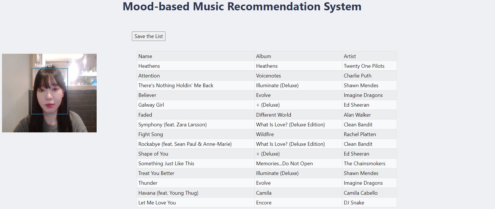

# Flask Wep App
A music recommendation system that recommends some songs based on user mood trained by using [FER2013 dataset](https://paperswithcode.com/dataset/fer2013).  
 

## Tech Stack
- Python 3.9.5  
- Flask 2.0.2  
- Opencv 4.5.5  
- Tensorflow 2.8.0  
- VsCode 1.52.1  
 

## take a look
- [Running Gunicorn in Colab,  
  Webcam In Google Colab,  
  How To Add Action Buttons In Flask](https://github.com/iamdami/Flask-Music-Recommendation-System/blob/main/note/22-02-02.md)  
 

## How to run Flask App on Colab
- [How to run Flask App on Colab](https://github.com/iamdami/Flask-Music-Recommendation-System/blob/main/note/how_to_run_flask_on_colab.md)  
 

  
